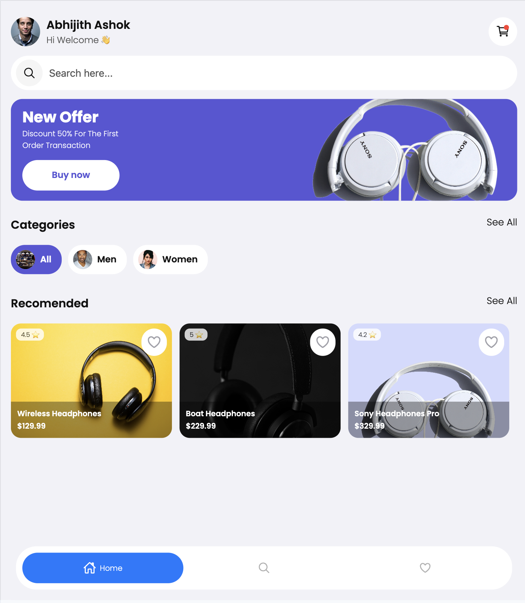
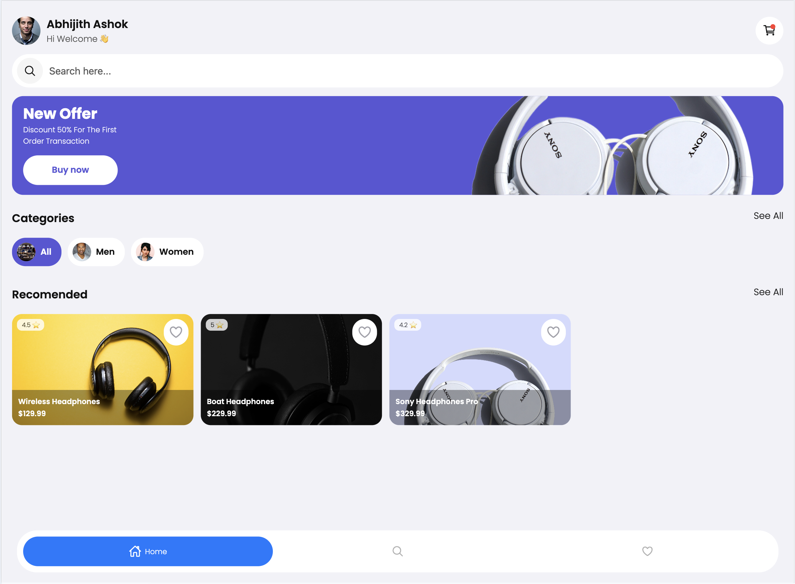
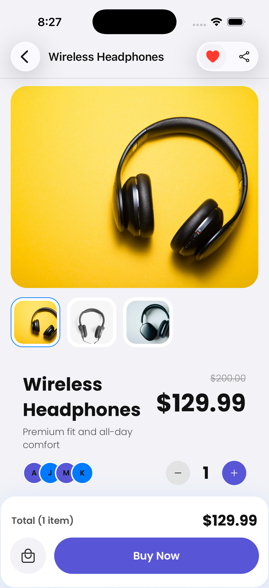
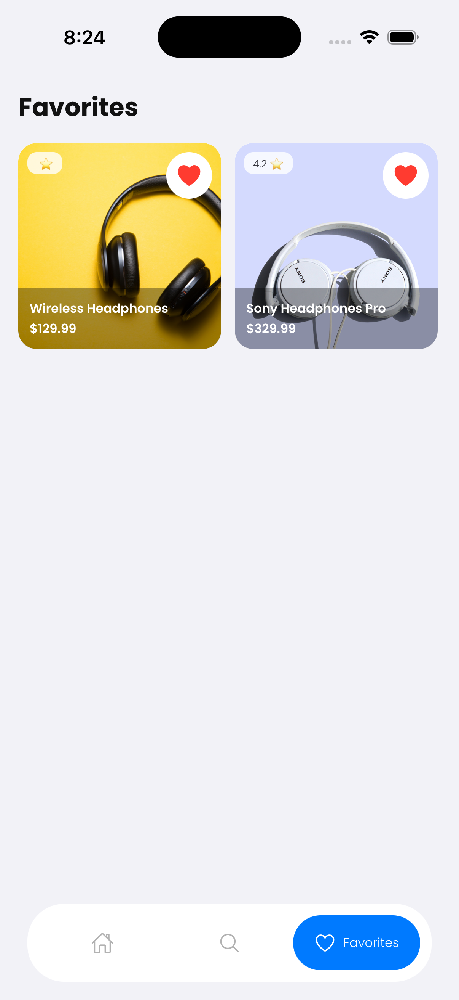
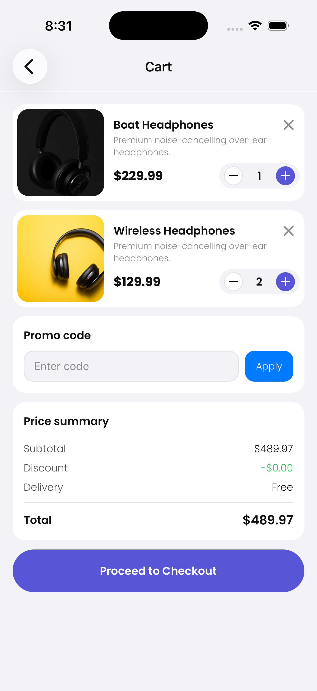
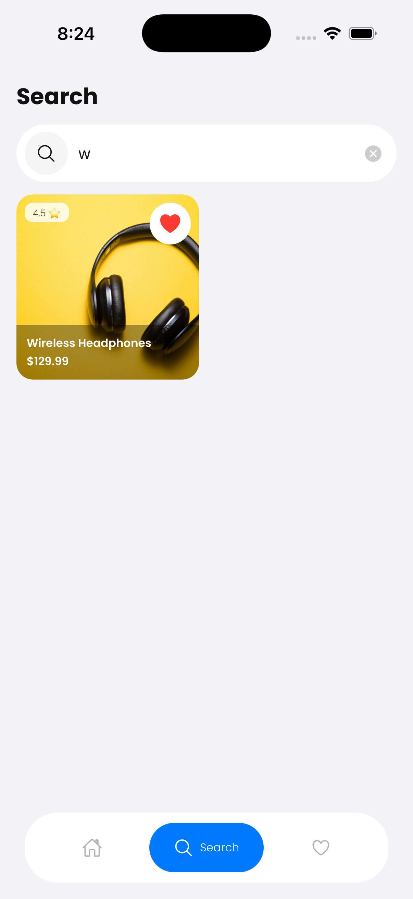

# ECommerseApp

React Native e-commerce app with product listing, product details, favorites, cart, search, and a React Native Web build target.

## Setup and Run

```sh
npm install
npm run ios
npm run android
npm run web
```

Notes:
- `npm run web` builds with Webpack and serves from `dist-web` on port `3000`.
- For iOS first-time setup, install pods if needed:
```sh
bundle install
bundle exec pod install
```

## Screenshots

> Place the screenshot files in `assets/screenshots` with the names below.

### Home

| Mobile | Tablet | Web |
|---|---|---|
|  |  |  |

### Product Details

| Details Screen |
|---|
|  |

### Favorites

| Favorites Screen |
|---|
|  |

### Cart

| Cart Screen |
|---|
|  |

### Search

| Search Screen |
|---|
|  |

## Project Structure

- `src/core`: navigation, shared components, theme, hooks, app-level types
- `src/data`: models, repositories, data sources
- `src/domain`: repository contracts and use cases
- `src/presentation`: screens, viewmodel hooks, context providers

## Technical Decisions

### 1) State Management Rationale

- Chosen approach: React Context + hooks (`useCart`, `useFavorites`, `useProduct`, `useTheme`).
- Why: the app has moderate shared state (theme, favorites, cart, product list) and does not yet require Redux/MobX complexity.
- Benefits:
	- Simple and explicit data flow.
	- Easy co-location of logic in provider + hook pairs.
	- Minimal boilerplate and good TypeScript ergonomics.

### 2) Architecture Choices

- Pattern used: layered, clean-ish separation by responsibility.
- `domain`: use cases and repository interfaces.
- `data`: repository implementations and remote/local data access.
- `presentation`: UI components/screens and state orchestration.
- Rationale:
	- Keeps UI independent of data source details.
	- Makes future API/local storage swaps easier.
	- Improves maintainability and testability per layer.

### 3) Persistence Strategy

- Local persistence is implemented with `@react-native-async-storage/async-storage`.
- Persisted data:
	- Favorites (`app_favorites` key).
	- Cart (`cart` key), including quantity updates and merge-on-add behavior.
- Rationale:
	- Works offline.
	- Lightweight and sufficient for current app requirements.
	- Easy hydration on app launch in context providers.

### 4) Performance and Security Considerations

- Performance:
	- `FlatList` used for product/cart lists (virtualized rendering).
	- `useMemo` and `useCallback` used in key UI paths (e.g., details screen calculations/handlers).
	- Image-heavy components are structured to minimize unnecessary rerenders.
- Security:
	- No sensitive secrets or tokens are stored in AsyncStorage.
	- Navigation params are typed via TypeScript for safer screen contracts.
	- Build artifacts (`dist-web`) are excluded from source tracking to reduce repository noise and risk.

### 5) Testing Strategy

- Framework: Jest + React Test Renderer.
- Current coverage focus:
	- UI behavior for bottom navigation.
	- Theme context behavior and hook constraints.
- Strategy:
	- Unit tests for provider logic and shared components.
	- Behavioral assertions for navigation interactions and conditional rendering.
	- Expand next into cart/favorites provider behavior and screen-level integration tests.

## Useful Scripts

```sh
npm start        # Start Metro
npm test         # Run tests
npm run lint     # Run eslint
npm run web:dev  # Webpack dev server
```
